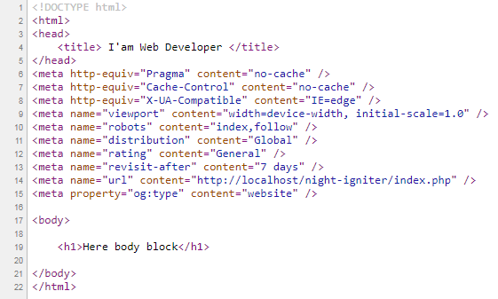

# Codeigniter Template Engine 

## Introduction

This template engine driver for codeigniter, includes : **Symfony Twig**, **Laravel Blade** and **SEO Library**.


## Installation

I think you know about the installation, but if you don't know ask me please, or you can learn from [Live Example](live_example/Readme.md)

## Usage


### Load Driver

```php
public function __construct()
{
	parent::__construct();

	$this->load->driver('template_engine'); // load driver
}
```

### Load Driver with Config parameters

```php
public function __construct()
{
	parent::__construct();

	$this->load->driver('template_engine', array(
		'cache_path' => APPPATH.'custom_cache_path',
		'view_paths' => array(
			APPPATH.'views' => APPPATH.'views' // initialize view paths
		),
		'adapter' => 'twig' // initialize adapter
	)); // load driver
}
```

### Initialize Driver

```php
$this->template_engine->initialize(array(
	'cache_path' => APPPATH.'custom_cache_path',
	'view_paths' => array(
		APPPATH.'views' => APPPATH.'views' // initialize view paths
	),
	'adapter' => 'twig' // initialize adapter
));
```

**Set cache path**

```php
$this->template_engine->set_cache_path(APPPATH.'custom_cache_path'); // set cache path
```

**Set view paths**

```php
$this->template_engine->set_view_paths(array(
	APPPATH.'views' => APPPATH.'views' // set view paths
));
```

**Set adapter**

```php
$this->template_engine->set_adapter('twig'); // set adapter
```

### Full Example for Symfony Twig

**application/controllers/Welcome.php :**

```php
class Welcome extends CI_Controller
{
	/**
	* constructor
	*/
	public function __construct()
	{
		parent::__construct();
		$this->load->driver('template_engine', array(
			'cache_path' => APPPATH.'cache',
			'view_paths' => array(
				APPPATH.'views' => APPPATH.'views' // initialize view paths
			),
			'adapter' => 'twig' // initialize adapter
		)); // load driver
	}

	public function index()
	{
		$this->template_engine->render('welcome_message');
	}
}
```

---

**application/views/welcome_message.twig :**

```twig


 I'am Web Developer 


	<h1>Here body block</h1>

```

---

**application/views/base.twig :**

```twig
<!DOCTYPE html>
<html>
<head>
	<title></title>
</head>
{# Render meta tags for SEO #}
{{ themes.seo.render() }}
<body>


    


</body>
</html>
```

---

**Result :**



---

### SEO Library

Source : libraries/Template_Engine/Template_engine.php

```php
/**
 * render
 * 
 * @param  string  $page   [description]
 * @param  array   $data   [description]
 * @return mixed
 */
public function render($page, $data = array())
{
	$data['themes'] = array(
		'seo' => $this->build_seo()
	);

	$this->{$this->adapter}->render($page, $data);
}
```

**Add meta tag**


HTML twig (append tags)

```twig
{{ 
	themes.seo
		.meta_tag('property', 'og:title', 'Welcome to my site') 
		.meta_tag('property', 'og:type', 'website')
		.meta_tag('name', 'url', base_url())
		.link_tag('stylesheet', 'https://fonts.googleapis.com/css?family=Source+Sans+Pro:300,400,600,700,300italic,400italic,600italic')
}}
```

HTML twig (render only meta tag)

```twig
{{ 
	themes.seo
		.meta_tag('property', 'og:title', 'Welcome to my site') 
		.meta_tag('property', 'og:type', 'website')
		.meta_tag('name', 'url', base_url())
		.link_tag('stylesheet', 'https://fonts.googleapis.com/css?family=Source+Sans+Pro:300,400,600,700,300italic,400italic,600italic')
		.meta_tag_render()
}}
```

HTML twig (render only link tag)

```twig
{{ 
	themes.seo
		.meta_tag('property', 'og:title', 'Welcome to my site') 
		.meta_tag('property', 'og:type', 'website')
		.meta_tag('name', 'url', base_url())
		.link_tag('stylesheet', 'https://fonts.googleapis.com/css?family=Source+Sans+Pro:300,400,600,700,300italic,400italic,600italic')
		.link_tag_render()
}}
```

**Render SEO**

HTML twig

```twig
{{ themes.seo.render() }}
```

```php
echo $themes['seo']->render();
```

---

<p align="center"></p>

[**PATREON**](https://www.patreon.com/agoenks29D)

[**PAYPAL**](https://www.paypal.me/agungdirgantara)

**[ETH](https://www.blockchain.com/eth/address/0x251b36840557cCe9A245f07E1b834bCfb7354FDb) : 0x251b36840557cCe9A245f07E1b834bCfb7354FDb**

**[DOGE](https://dogechain.info/address/DFmES6KZLQXimXduXwKmooykMsjhWmT1tU) : DFmES6KZLQXimXduXwKmooykMsjhWmT1tU**

**[BITCOIN](https://www.blockchain.com/btc/address/1MEqUeg7fXTkBMFWfJZE9yJREsKZ4SUxQM) : 1MEqUeg7fXTkBMFWfJZE9yJREsKZ4SUxQM**

**[BITCOIN CASH](https://www.blockchain.com/bch/address/qzrllcyrjwvpnuur5kpeyp03p246fzsgzvhleswr6f) : qzrllcyrjwvpnuur5kpeyp03p246fzsgzvhleswr6f**

### Social Media : 

<a class="social_link" href="https://fb.me/agoenks29D">
	
</a>

<a class="social_link" href="https://instragram.com/agoenks29D">
	
</a>

<a class="social_link" href="https://t.me/agoenks29D">
	
</a>

<a class="social_link" href="https://api.whatsapp.com/send?phone=6282167368585&text=Hello,i get your contact from github">
	
</a>

<a class="social_link" href="https://www.youtube.com/channel/UCwXyVSMRqAuyyQtXVoMrf2A?view_as=subscriber&sub_cotnfirmation=1">
	
</a> 

<p></p>

<p align="center"><b>Made with ❤️ + ☕ ~ Agung Dirgantara</b></p>